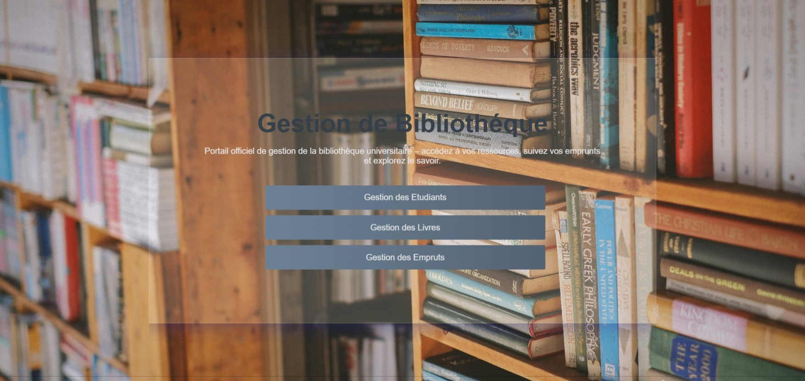
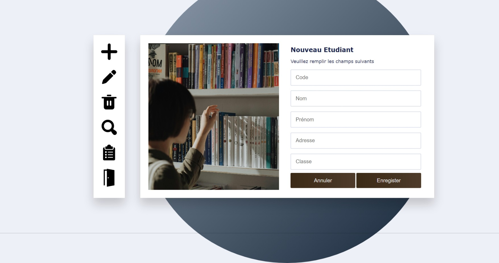

# Library Management System 📗
A dynamic web application for managing library resources.
Built using HTML, CSS, JavaScript, PHP, and MySQL, this system allows librarians to manage books, users, and transactions efficiently.
This project was created as part of a university web development course, and showcases my understanding of full-stack development fundamentals.

## Features
- Add, edit, delete and show the list of books available.
- Add, edit, delete and show the list of students.
- Search for books by title, author, or publication date.
- Record book borrowing and return transactions.
- MySQL database to store and retrieve data.
- Easy to use navigation bars on every page.

## Screenshots





## Tech Stack
**Frontend**: HTML, CSS, JavaScript

**Backend**: PHP

**Database**: MySQL

**Server**: Localhost (XAMPP / WAMP / MAMP)

## Setup Instructions
1. Clone this repository:
```git clone https://github.com/your-username/library-management-system.git```
2. Import the database:
Open your local MySQL (e.g., phpMyAdmin).
Create a the database by importing the data in the Data base folder
3. Run the app:
Start your Apache & MySQL servers.

## License
* For educational purposes only. *

📚 Notes
This was an early dynamic project to demonstrate CRUD operations, form handling, and connecting a frontend to a backend with a database.
The project lacks some features of a full production-ready system.


Ask ChatGPT

